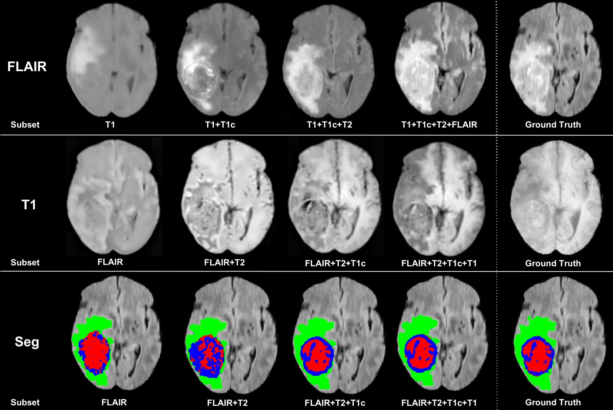

# Overview
This repository provides source code and pre-trained models for brain tumour segmentation in presence of missing modalities. The models have been trained and tested on BraTS dataset. The method is detailed in [1]. Our method allows to deal with missing modalities.

This implementation is based on NiftyNet and Tensorflow.

If you use any resources in this repository, please cite the following papers:

* [1] Reuben Dorent, Samuel Joutard, Marc Modat, Sebastien Ourselin, Tom Vercauteren. "AHetero-Modal Variational Encoder-Decoder for
Joint Modality Completion and Segmentation." In MICCAI 2019.
* [2] Eli Gibson*, Wenqi Li*, Carole Sudre, Lucas Fidon, Dzhoshkun I. Shakir, Guotai Wang, Zach Eaton-Rosen, Robert Gray, Tom Doel, Yipeng Hu, Tom Whyntie, Parashkev Nachev, Marc Modat, Dean C. Barratt, Sébastien Ourselin, M. Jorge Cardoso^, Tom Vercauteren^.
"NiftyNet: a deep-learning platform for medical imaging." Computer Methods and Programs in Biomedicine, 158 (2018): 113-122. https://arxiv.org/pdf/1709.03485


An example of brain tumor segmentation result.

# Requirements
* A CUDA compatable GPU with memory not less than 12GB is recommended for training. For testing only, a smaller GPU should be suitable.

* For this work we will first create a python environement
```bash
virtualenv -p python3 ./uhved_python
source ./uhved_python/bin/activate
```

* Tensorflow - NiftyNet. Install tensorflow 1.12.2 (https://www.tensorflow.org/install/) and NiftyNet (http://niftynet.readthedocs.io/en/dev/installation.html) or simply typing
```bash
pip install -r requirements.txt
```
* A small change in niftynet is required for our multi-modal application.
```bash
cp ./utils/user_parameters_custom.py ./uhved_python/lib/python3.6/site-packages/niftynet/utilities
export PATH=$PATH:$(pwd)/extensions/
```

* BraTS 2018 dataset. Data can be downloaded from http://braintumorsegmentation.org/

# How to use
## 1, Prepare data
* Download BraTS dataset, and uncompress the training and tesing zip files. For example, the training set will be in `./data/BRATS18Training`.
As preprocessing step, background is cropped. The rest of the preprocessing is in the configuration files.
```bash
python ./utils/cropping.py --input ./data/BRATS18Training --output  ./data/BRATS2018
```

## 2, Use pre-trained models to segment images
* To segment multimodal scans using U-HeMIS, run:

```bash
python inference.py -n u_hemis -t1 ./data/BRATS2018/HGG3_T1.nii.gz -t2 ./data/BRATS2018/HGG3_T2.nii.gz  -t1c ./data/BRATS2018/HGG3_T1c.nii.gz -fl ./data/BRATS2018/HGG3_Flair.nii.gz
```
* To segment multimodal scans using U-HVED, run:

```bash 
python inference.py -n u_hved -t1 ./data/BRATS2018/HGG3_T1.nii.gz -t2 ./data/BRATS2018/HGG3_T2.nii.gz  -t1c ./data/BRATS2018/HGG3_T1c.nii.gz -fl ./data/BRATS2018/HGG3_Flair.nii.gz
```

* The networks allows for missing modalities, consequently the number of modalities as input can vary. For example:
```bash 
python inference.py -n u_hved -t2 ./data/BRATS2018/HGG3_T2.nii.gz  -t1c ./data/BRATS2018/HGG3_T1c.nii.gz
```

## 3, How to train

The following commands show how to train our models using BRATS18. Look at the config files in  `./extensions/u_hemis` and `./extensions/u_hved` for changing the config settings. Documentation is available here: https://niftynet.readthedocs.io/en/dev/config_spec.html.

* Train models using U_HeMIS. Run: 
```bash
net_run train -a  u_hemis.application.U_HeMISApplication  -c ./extensions/u_hemis/config.ini
```

* Train models using U_HVED. Run:
```bash
net_run train -a  u_hved.application.U_HVEDApplication  -c ./extensions/u_hved/config.ini
```

# Copyright
* Copyright (c) 2019, King's College London. All rights reserved.
